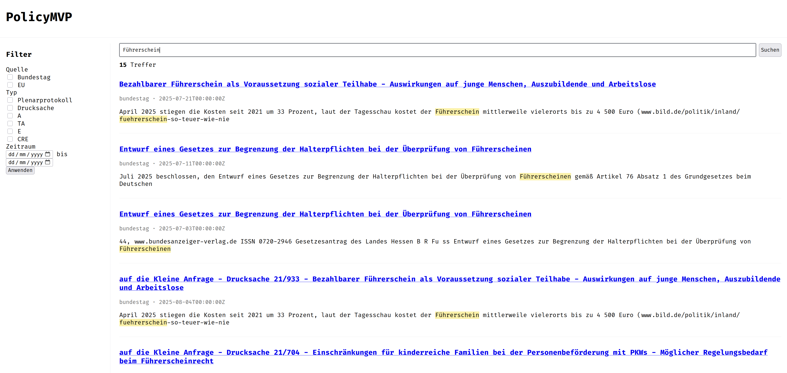

# PolicyMVP

Search-first web app for monitoring government protocols. FastAPI + Jinja + HTMX, OpenSearch for indexing/search.

## Quick start

1. Python 3.11+ recommended. Create & activate a venv:

```bash
python -m venv .venv
source .venv/bin/activate
```

2. Install deps:

```bash
pip install -r requirements.txt
```

3. Configure .env (copy from .env.example):

```bash
cp .env.example .env
```

4. Ensure OpenSearch is running locally (default at http://localhost:9200). The app will fail to start if OpenSearch is not reachable.

```bash
docker run -d -p 9200:9200 -p 9600:9600 -e "discovery.type=single-node" -e "DISABLE_SECURITY_PLUGIN=true" --name opensearch opensearchproject/opensearch:latest
```

5. Initialize index:

```bash
python scripts/init_opensearch.py
```

6. Ingest Bundestag DIP data (see below), then run the app:

```bash
uvicorn app.app:app --reload
```

Then open http://127.0.0.1:8000

### Bundestag DIP data ingestion

Set your DIP API key and (optionally) a backfill date range in your shell or `.env`:

```bash
export DIP_API_KEY="<your_api_key>"
# Optional backfill window; defaults are shown in .env.example
export BACKFILL_START="2025-07-01"
export BACKFILL_END="2025-08-22"

# (Re)create index
python scripts/recreate_index.py

# Backfill over the given window
python scripts/ingest_bundestag_backfill.py

# Daily ingestion (yesterday by default, override with DAILY_DATE=YYYY-MM-DD)
python scripts/ingest_bundestag_daily.py

# or replace bundestag with eu
```

Frontend with highlighting:


